The purpose of **Data Professionals** is to collect data, process it to extract its value, and, most importantly, communicate the resulting information in an efficient way to end users.

Those operations are conducted throughout what is called the **Data Pipeline**. The Data Pipeline is made of conduits, processing plants, and storage facilities which organize the **Data Flow** – the movement and transformation of data along the pipeline.

```mermaid
---
config:
  layout: dagre
  theme: dark
---
flowchart TB
 subgraph DWH["Data Warehouse"]
    direction LR
        Bronze["Bronze Layer<br>(Raw Data)"]
        TP1(["Data<br>Transformation"])
        Silver["Silver Layer<br>(Cleaned Data)"]
        TP2(["Data<br>Transformation"])
        Gold["Gold Layer<br>(Business-Ready Data)"]
  end
    Sources["Source Systems"] --> IC(["Ingestion"])
    IC --> Bronze
    Bronze --> TP1
    TP1 --> Silver
    Silver --> TP2
    TP2 --> Gold
    Gold --> AP(["Analysis"]) & DSP(["Prediction Model<br/>Development"])
    AP --> AC(["Communication"])
    AC --> Users["End Users"]
    DSP --> DSC(["Predictions Delivery"])
    DSC --> Users

    style Bronze fill:#cd7f32,color:none
    style TP1 fill:#8b5cf6,color:none
    style Silver fill:#c0c0c0,color:#000000
    style TP2 fill:#8b5cf6,color:none
    style Gold fill:#ffd700,color:#000
    style Sources fill:#3b82f6,color:none
    style IC fill:#c40045,color:none
    style AP fill:#038a0a,color:none
    style DSP fill:#ec4899,color:none
    style AC fill:#038a0a,color:none
    style Users fill:#3b82f6,color:none
    style DSC fill:#ec4899,color:none
    style DWH fill:#1e293b,stroke:#8b5cf6,stroke-width:3px
```

