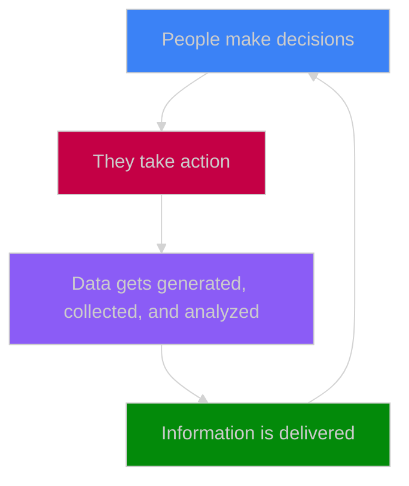

We produce numeric data whenever we use a numeric device either as a by-product of our actions – since they are tracked – or as their primary product – when I type those characters, or when a salesperson logs some information in a [customer relationship management system](https://en.wikipedia.org/wiki/Customer_relationship_management).

This information is collected to provide value, in some way or another, to ourselves, another individual, or an organization that will consume it. This resource is valuable because it allows us to make informed decisions.

Organizations (private companies, public institutions, or non-profit organizations) are major consumers of numeric information, especially technology-oriented organizations. The data they collect is essential for them to be able to make sensible decisions. Organizations are looking to draw as much value as possible from data: this requires collecting it and turning it into actionable insights for the organization and/or its customers to use. The growing (i) amount of data that gets collected and (ii) complexity of the processing required to turn it into user-friendly information is what gives rise to Data as a distinct professional field.
