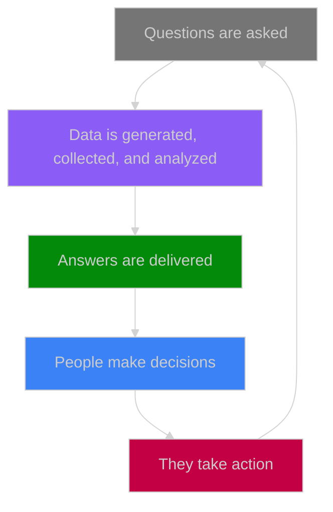

We produce numeric data whenever we use a numeric device either as a by-product of our actions – if they are tracked – or as their primary product – when I type those characters, or when a salesperson logs some information in a [customer relationship management system](https://en.wikipedia.org/wiki/Customer_relationship_management).

This information is collected to provide value, in some way or another, to ourselves, another individual, or an organization that will consume it. Information is a valuable resource because it allows us to make informed decisions.

```mermaid
---
config:
  layout: dagre
  theme: dark
---
flowchart TB
    X --> C["Data is generated, collected, and analyzed"]
    A["People make decisions"] --> B["They take action"]
    B --> X["Questions are asked"]
    C --> D["Answers are delivered"]
    D --> A

    style X fill:#757575,color:none
    style A fill:#3b82f6,color:none
    style B fill:#c40045,color:none
    style C fill:#8b5cf6,color:none
    style D fill:#038a0a,color:none
```

Organizations (companies, public institutions, etc.) are major consumers of numeric information, especially organizations whose activities are digital (e.g., those in the technology, banking, or e-commerce sectors). The data they collect is essential for them to be able to make informed decisions. Organizations therefore look to draw as much value as possible from the data concerning them, which requires collecting it, turning it into usable datasets, and, finally, analyzing it to deliver actionable insights to the organization and/or its customers. The growth in (i) the amount of data collected and (ii) the complexity of the processing required to extract those insights is what gave rise to Data as a distinct professional field.
