Le but des **Professionnels de la Data** est de collecter les données, de les traiter pour en extraire la valeur et, surtout, de communiquer les informations résultantes de manière efficace aux utilisateurs finaux.

Ces opérations sont menées tout au long de ce que l'on appelle le **Pipeline de Données**. Le Pipeline de Données est constitué de tuyaux, d'usines et d'entrepots qui organisent le **Flux de Données** – le mouvement et la transformation des données le long du pipeline.

```mermaid
---
config:
  layout: dagre
  theme: dark
---
flowchart TB
 subgraph DWH["Data Warehouse"]
    direction LR
        Bronze["Couche bronze<br>(donnée brute)"]
        TP1(["Transformation<br>de données"])
        Silver["Couche argent<br>(donnée nettoyée)"]
        TP2(["Transformation<br> de données"])
        Gold["Couche or<br>(donnée prête à l'emploi)"]
  end
    Sources["Source Systems"] --> IC(["Ingestion"])
    IC --> Bronze
    Bronze --> TP1
    TP1 --> Silver
    Silver --> TP2
    TP2 --> Gold
    Gold --> AP(["Analyse"]) & DSP(["Développement de<br/>modèles prédictifs"])
    AP --> AC(["Communication"])
    AC --> Users["Utilisateurs finaux"]
    DSP --> DSC(["Exection et distribution<br>des prédictions"])
    DSC --> Users

    style Bronze fill:#cd7f32,color:none
    style TP1 fill:#8b5cf6,color:none
    style Silver fill:#c0c0c0,color:#000000
    style TP2 fill:#8b5cf6,color:none
    style Gold fill:#ffd700,color:#000
    style Sources fill:#3b82f6,color:none
    style IC fill:#c40045,color:none
    style AP fill:#038a0a,color:none
    style DSP fill:#ec4899,color:none
    style AC fill:#038a0a,color:none
    style Users fill:#3b82f6,color:none
    style DSC fill:#ec4899,color:none
    style DWH fill:#1e293b,stroke:#8b5cf6,stroke-width:3px
```

