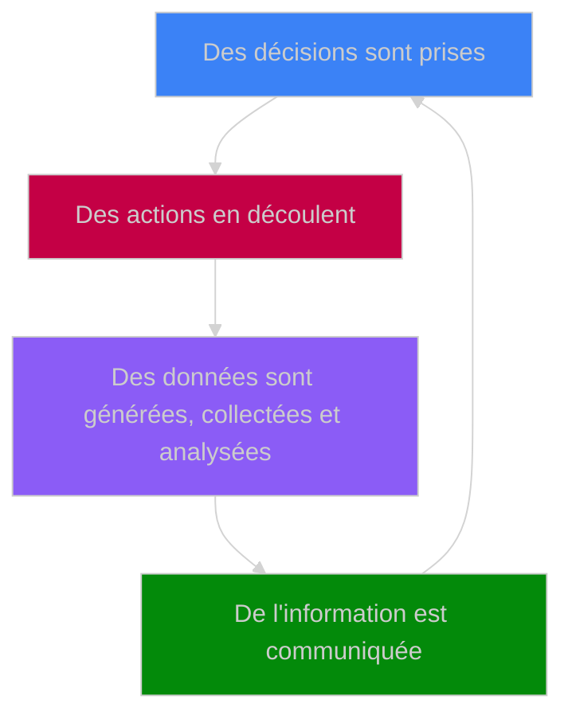

Nous produisons des données numériques chaque fois que nous utilisons un appareil numérique, soit comme sous-produit de nos actions – puisqu'elles sont suivies – soit comme produit principal – lorsque je tape ces caractères, ou lorsqu'un commercial enregistre des informations dans un [système de gestion de la relation client](https://fr.wikipedia.org/wiki/Gestion_de_la_relation_client).

Ces informations sont collectées pour apporter de la valeur, d'une manière ou d'une autre, à nous-mêmes, à un autre individu ou à une organisation qui les consommera. Cette ressource est précieuse car elle nous permet de prendre des décisions éclairées.

Les organisations (entreprises privées, institutions publiques ou organisations à but non lucratif) sont les principaux consommateurs d'informations numériques, en particulier les organisations technologiques dont l'activité est centrée sur les appareils numériques. Les données qu'elles collectent sont essentielles pour leur permettre de prendre des décisions sensées. Les organisations cherchent à tirer le maximum de valeur des données : cela nécessite de les collecter et de les transformer en informations exploitables pour l'organisation et/ou ses clients. La croissance (i) de la quantité de données collectées et (ii) de la complexité du traitement nécessaire pour les transformer en informations exploitables est ce qui fait naître la Data en tant que domaine professionnel distinct.
