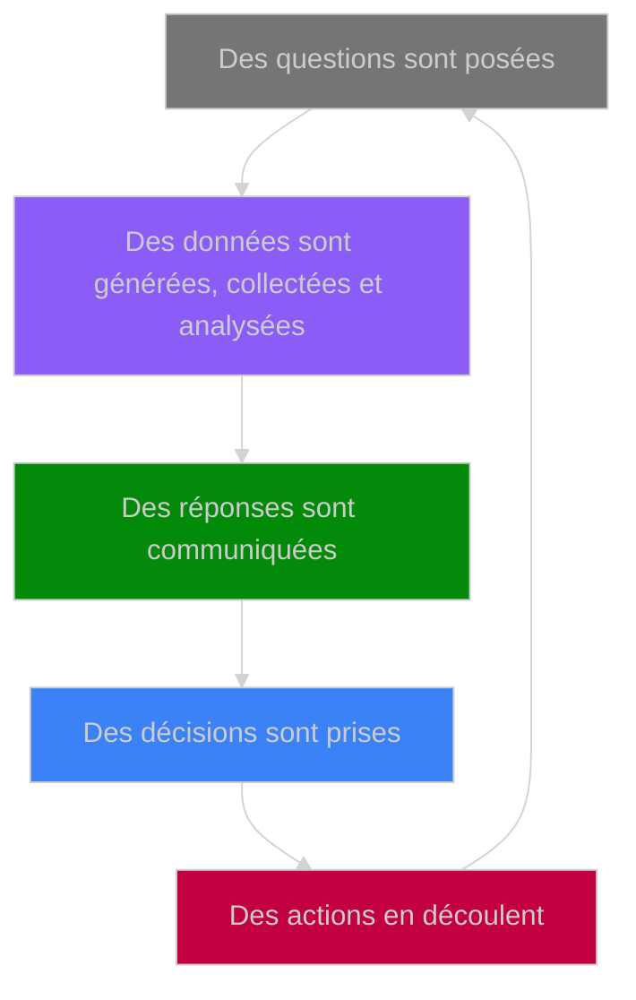

Nous produisons des données numériques chaque fois que nous utilisons un appareil numérique, soit comme sous-produit de nos actions – lorsqu'elles sont trackées – soit comme leur produit principal – lorsque je tape ces caractères, ou lorsqu'un commercial enregistre des informations dans un [système de gestion de la relation client](https://fr.wikipedia.org/wiki/Gestion_de_la_relation_client).

Ces informations sont collectées pour apporter de la valeur, d'une manière ou d'une autre, à nous-mêmes, à un autre individu ou à une organisation qui les consommera. L'information est une ressource précieuse car elle nous permet de prendre des décisions éclairées.

```mermaid
---
config:
  layout: dagre
  theme: dark
---
flowchart TB
    X --> C["Des données sont générées, collectées et analysées"]
    A["Des décisions sont prises"] --> B["Des actions en découlent"]
    B --> X["Des questions sont posées"]
    C --> D["Des réponses sont communiquées"]
    D --> A

    style X fill:#757575,color:none
    style A fill:#3b82f6,color:none
    style B fill:#c40045,color:none
    style C fill:#8b5cf6,color:none
    style D fill:#038a0a,color:none
```

Les organisations (entreprises, institutions publiques, etc.) sont les principaux consommateurs d'informations numériques, en particulier les organisations dont les activités sont digitales (e.g., celles des secteurs de la technologie, de la banque ou du e-commerce). Les données qu'elles collectent sont essentielles pour leur permettre de prendre des décisions informées. Les organisations cherchent ainsi à tirer le maximum de valeur des données les concernant, ce qui nécessite de les collecter, de les transformer en jeux de données exploitables et, enfin, de les analyser pour fournir des résultats actionnables à l'organisation et/ou à ses clients. La croissance (i) de la quantité de données collectées et (ii) de la complexité du traitement nécessaire pour en tirer ces informations utiles est ce qui a fait naître la Data en tant que domaine professionnel distinct.
